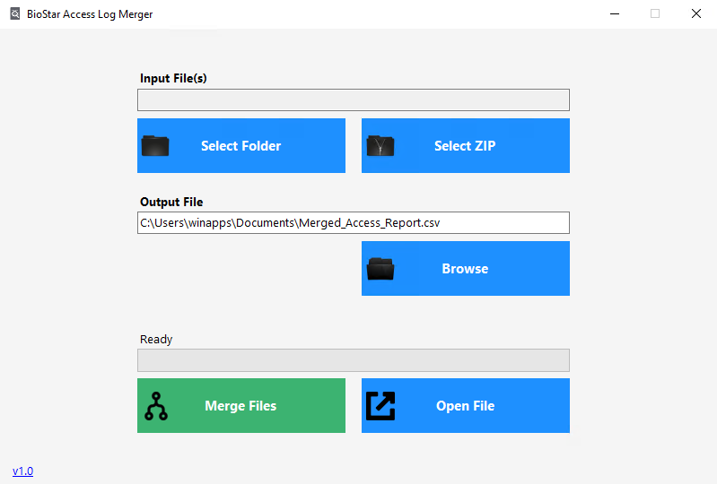

# BioStar Access Log CSV Merger

A lightweight Windows utility that merges multiple BioStar 2 CSV access logs into a single consolidated report.

Designed for HR teams and administrators who need to process large monthly access logs without manually handling dozens (or hundreds) of CSV files.

## 🚀 Why This Exists

BioStar 2 limits CSV export to 5000 records per file.  
Large installations can generate 700,000+ logs per month, resulting in 100+ separate CSV files.

This tool:

- Merges all CSV files into one file
- Automatically removes duplicate headers
- Supports ZIP exports directly from BioStar
- Handles large files efficiently (streaming mode)
- Requires no technical knowledge to operate

---

## 🖥️ Desktop Version (v1.0)

✔ Native Windows application  
✔ ZIP or Folder input support  
✔ Custom output location  
✔ Progress bar indicator  
✔ One-click merge  
✔ “Open file after merge” option  
✔ Fully standalone executable (no installation required)

---

## 📷 Screenshots

---

## ⚙️ How To Use (Desktop Version)

1. Download the `.exe` file from the **Releases** section.
2. Run the application.
3. Select:
   - A folder containing CSV files  
   OR  
   - A ZIP file exported from BioStar
4. Choose the output file location.
5. Click **Merge Files**.
6. Open the merged report.

---

## 🐍 CLI Version (v0.5 - Python)

Earlier version of this tool was a command-line Python script.

Usage: 
`python merge_csvs.py --input-dir "path/to/csvs" --output "merged.csv"`

This version required manual ZIP extraction.

---

## 🧱 Tech Stack

### Desktop Version (v1.0)
- C#
- .NET 10
- Windows Forms
- System.IO Streaming API
- Self-contained single-file publish

### CLI Version (v0.5)
- Python 3
- Standard `csv` and `os` modules

---

## 📦 Distribution

Source code is available in this repository.  
Compiled executables are available under the **Releases** section.

---

## 👨‍💻 Author

Made by Lonixndu

GitHub: https://github.com/Lonixndu

---
